# Campus Connect - Backend (Laravel)

---

## 👥 Anggota Tim

1. FANI AMALIA RISWATI_STI202303652

---

## hasil deploy vercel pada link berikut :##

https://tugas-besar-webdanmobile.vercel.app/

## 📱 Deskripsi Proyek

**Campus Connect Backend** adalah REST API dan Web Application berbasis Laravel yang mendukung aplikasi mobile Flutter dan antarmuka web untuk komunikasi dan kolaborasi mahasiswa. Meliputi manajemen pengguna, postingan feed, chat real-time, forum diskusi, notifikasi, dan sistem pelaporan.

---

## 🛠 Tech Stack

| Teknologi                 | Kegunaan                              |
| ------------------------- | ------------------------------------- |
| **Laravel 13.x**          | Framework PHP utama                   |
| **PHP ^8.3**              | Runtime                               |
| **Laravel Sanctum**       | API token authentication (SPA/mobile) |
| **Laravel Reverb**        | WebSocket server real-time            |
| **Laravel Echo + Pusher** | Client-side broadcasting              |
| **SQLite / MySQL**        | Database                              |
| **Tailwind CSS v4**       | Styling antarmuka web                 |
| **Vite**                  | Build tool frontend                   |
| **League Flysystem S3**   | Storage file/media                    |

---

## 📸 Dokumentasi Web & Logic Controller

### 1. Landing Page & Autentikasi

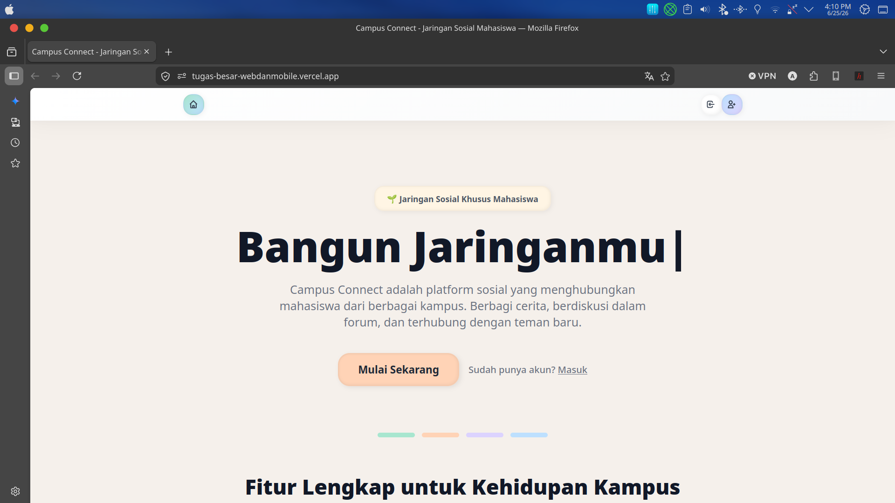
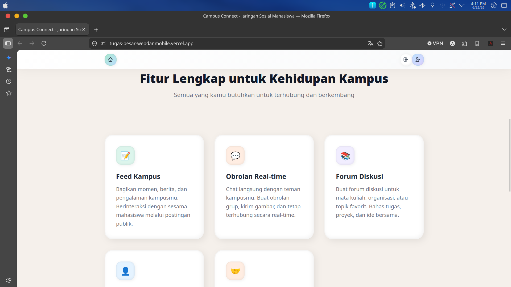
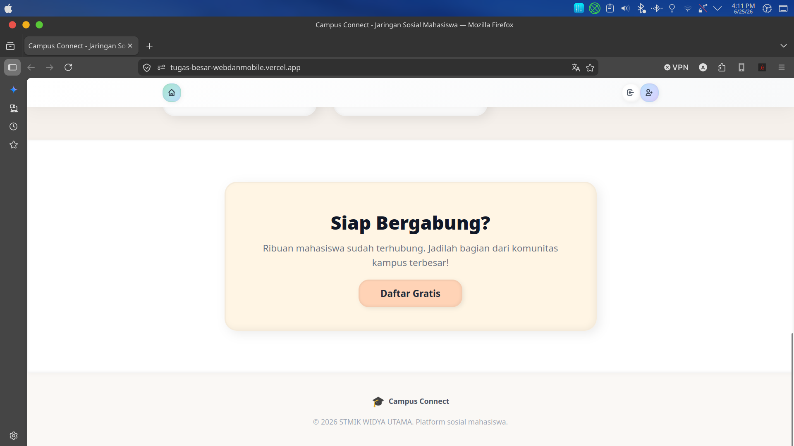
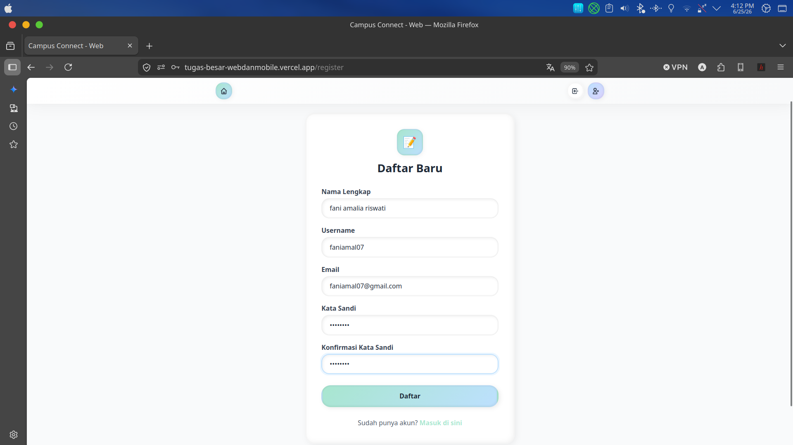

## Proses pada Controller

**Controller : `Web\AuthController`**

Controller ini bertanggung jawab mengelola seluruh proses autentikasi pengguna. Ketika pengguna memilih menu **Login**, sistem akan menampilkan halaman login. Saat tombol login ditekan, controller menerima email atau username beserta password, kemudian melakukan proses autentikasi. Jika data valid, sistem membuat session baru dan mengarahkan pengguna ke halaman **Home**, sedangkan jika gagal akan menampilkan pesan kesalahan.

Pada proses registrasi, controller memvalidasi seluruh data yang diinput, membuat akun baru, kemudian secara otomatis melakukan login sehingga pengguna dapat langsung menggunakan aplikasi. Selain itu, controller juga menangani proses logout dengan menghapus session pengguna dan mengembalikannya ke halaman Landing Page.

### 2. Halaman Home & Feed

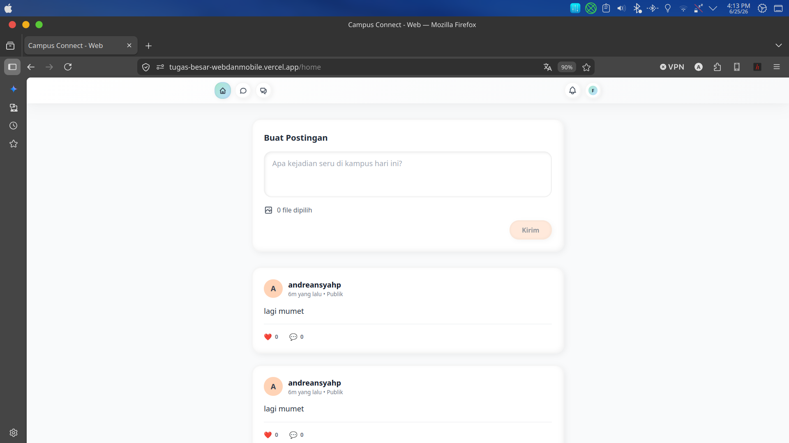
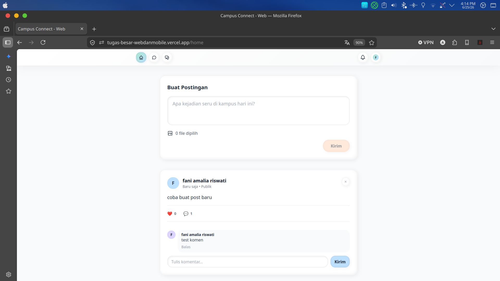

## Proses pada Controller

**Controller : `Web\HomeController` dan `Web\PostController`**

Saat halaman Home dibuka, controller mengambil seluruh data postingan dari database kemudian mengirimkannya ke halaman web agar dapat ditampilkan sebagai feed. Ketika pengguna menggulir halaman ke bawah, controller akan memuat postingan berikutnya secara bertahap (infinite scroll) tanpa perlu me-refresh halaman.

Apabila pengguna membuat postingan baru, controller akan memvalidasi data yang dikirim, menyimpan isi postingan beserta gambar apabila ada media yang diunggah, kemudian menampilkan postingan tersebut ke dalam feed. Controller juga menangani proses mengubah maupun menghapus postingan dengan memastikan bahwa hanya pemilik postingan atau admin yang memiliki hak untuk melakukannya.

Selain itu, setiap komentar yang dikirim pengguna akan divalidasi dan disimpan sehingga langsung muncul pada postingan terkait. Ketika pengguna memberikan reaksi seperti Like, controller akan memeriksa apakah reaksi tersebut sudah pernah diberikan. Jika sudah, reaksi akan dihapus, sedangkan jika belum maka reaksi baru akan ditambahkan.

### 3. Halaman Chat & Pesan

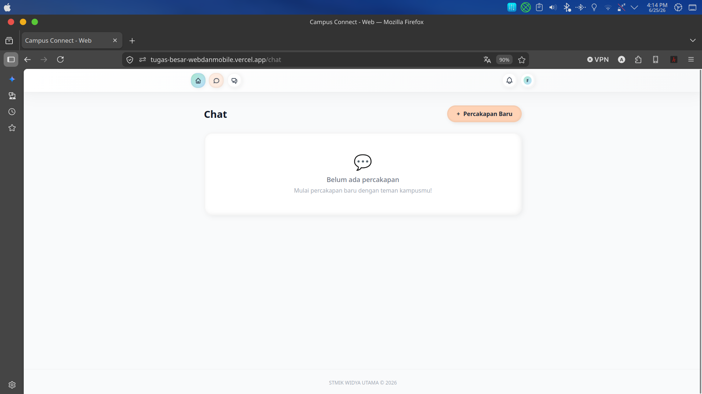
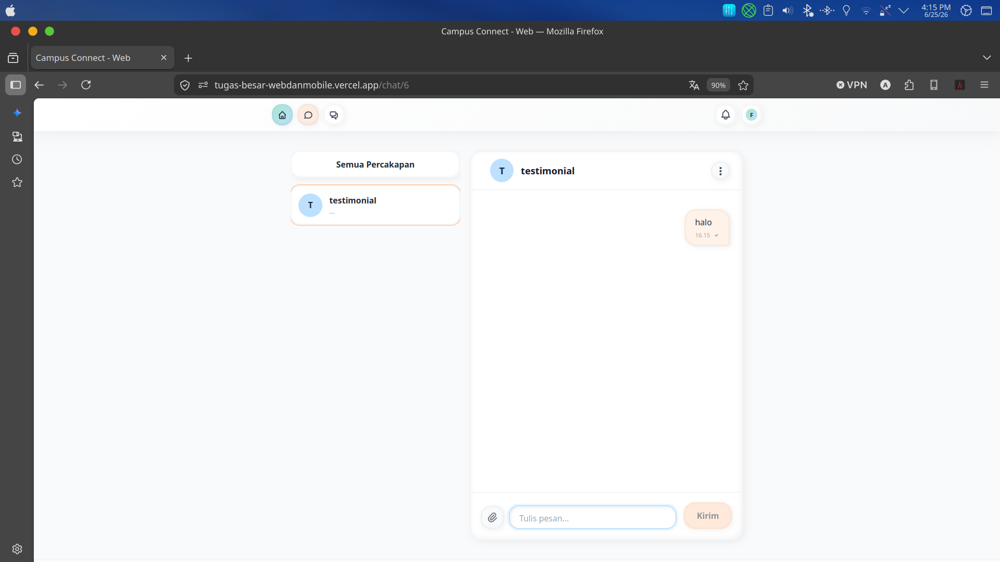
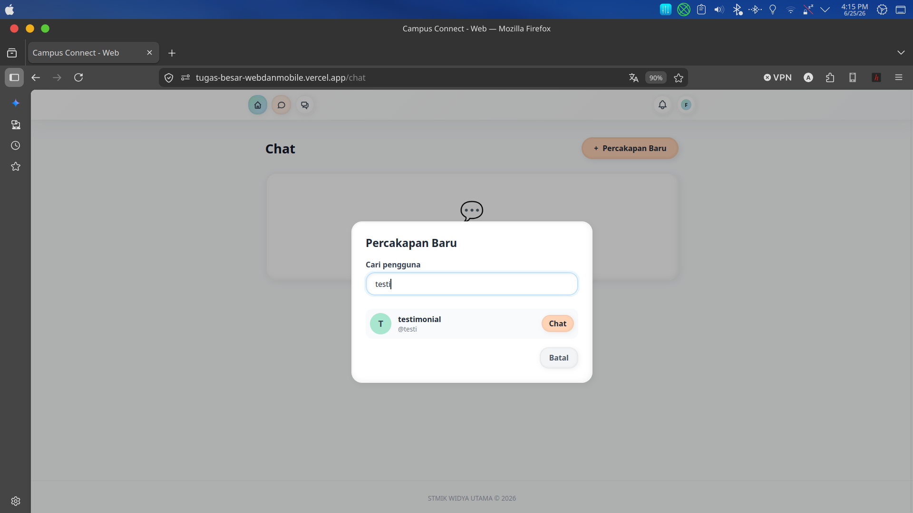

## Proses pada Controller

**Controller : `Web\ChatController`**

Controller mengelola seluruh aktivitas percakapan pada aplikasi. Saat pengguna membuka menu Chat, sistem mengambil seluruh daftar percakapan beserta informasi lawan bicara atau grup yang diikuti. Ketika salah satu percakapan dipilih, controller memuat riwayat pesan secara bertahap agar proses pemuatan lebih ringan.

Saat pengguna mengirim pesan, controller memvalidasi isi pesan maupun file yang diunggah, kemudian menyimpannya ke database sebelum mengirimkannya secara real-time kepada penerima menggunakan Laravel Reverb. Controller juga menangani proses membaca pesan, menghapus pesan atau percakapan, membuat chat baru, mengundang anggota ke grup, menerima atau menolak undangan grup, keluar dari grup, serta mencari pengguna lain untuk memulai percakapan baru.

### 4. Halaman Forum & Diskusi


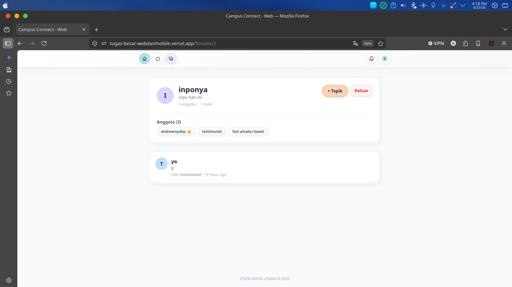
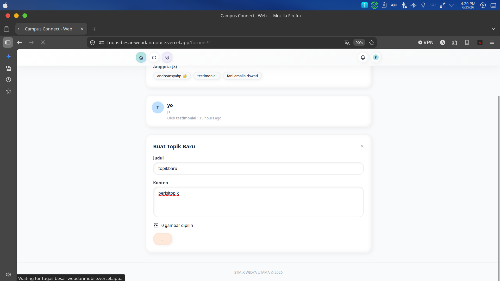

## Proses pada Controller

**Controller : `Web\ForumController`**

Controller bertanggung jawab mengelola seluruh aktivitas pada forum diskusi. Ketika pengguna membuka menu Forum, sistem menampilkan daftar forum yang tersedia maupun forum yang telah diikuti. Pengguna dapat membuat forum baru, bergabung ke forum, atau membuka salah satu forum untuk melihat seluruh topik diskusi.

Saat pengguna membuat topik baru ataupun memberikan komentar, controller akan memvalidasi data serta media yang diunggah sebelum menyimpannya ke database. Controller juga menangani proses menghapus topik dan komentar sesuai hak akses pengguna, mengundang anggota baru ke forum, mengeluarkan anggota apabila diperlukan, serta memproses penerimaan maupun penolakan undangan forum.

### 5. Halaman Notifikasi

## Proses pada Controller

**Controller : `Web\NotificationController`**

Controller mengambil seluruh notifikasi terbaru milik pengguna dan menampilkannya pada halaman notifikasi. Setiap aktivitas penting, seperti pesan baru, balasan komentar, maupun undangan grup atau forum, akan menghasilkan notifikasi yang dikirim secara real-time sehingga pengguna dapat langsung mengetahuinya tanpa perlu me-refresh halaman.

### 6. Halaman Profil

## Proses pada Controller

**Controller : `Web\ProfileController`**

Controller menangani pengelolaan informasi akun pengguna. Saat halaman Profil dibuka, sistem mengambil data pengguna yang sedang login kemudian menampilkannya pada form. Ketika pengguna menyimpan perubahan, controller memvalidasi data sebelum memperbarui informasi pada database. Controller juga menangani proses pergantian password dengan memverifikasi password lama terlebih dahulu sebelum menyimpan password baru.

---

## 🏗 Arsitektur Backend

```
Request → Route → Controller → Service Layer → Model/Eloquent → Database
                              ↕
                     Event Broadcasting (Reverb)
                              ↕
                     Queue / Job Processing
```

**Service Layer:** AuthService, PostService, ForumService, ConversationService, MessageService, ReportService, NotificationService, UserService, DeviceTokenService — semua logika bisnis dipisahkan dari controller.

**Real-time:** Laravel Reverb untuk WebSocket:

- `MessageSent` → channel `private-conversation.{id}`
- `MessageRead` → channel `private-conversation.{id}`
- `NotificationCreated` → channel `private-user.{id}`
- Presence channel `presence-conversation.{id}` untuk typing indicator & online status

**Storage:** Public disk untuk upload gambar, Flysystem S3 untuk penyimpanan file.

---

## ⚙️ Cara Instalasi & Menjalankan

```bash
# Clone repository
git clone <repository-url>
cd TugasBesar_Backend-main

# Install PHP dependencies
composer install

# Setup environment
cp .env.example .env
php artisan key:generate

# Setup database & migrate
php artisan migrate

# Install & build frontend assets
npm install
npm run build

# Jalankan development server (dengan queue, logs, dan vite)
composer dev
```

Atau secara individual:

```bash
php artisan serve          # Web server
php artisan queue:listen   # Queue worker
php artisan pail           # Log viewer
npm run dev                # Vite HMR
```

---

## 📄 Lisensi

Lisensi proyek ini adalah open source.
